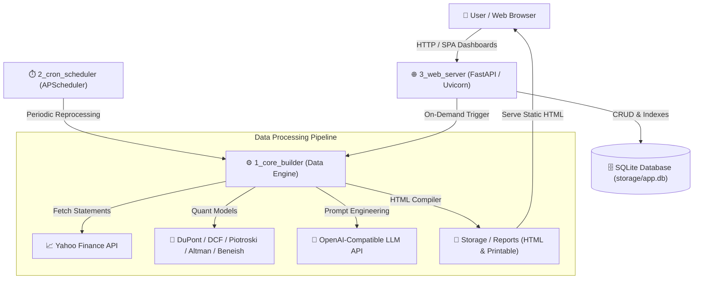
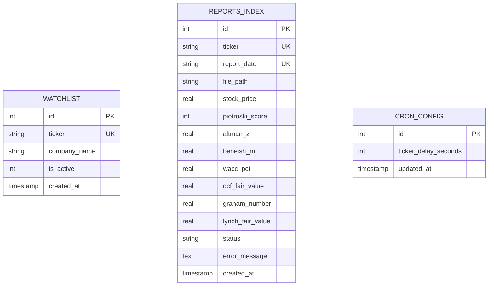
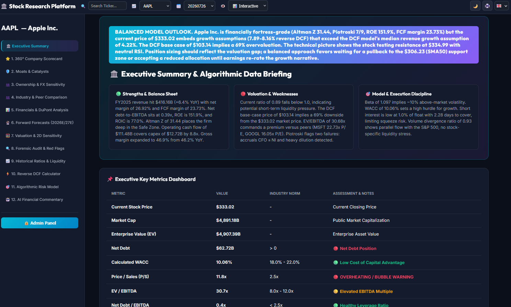
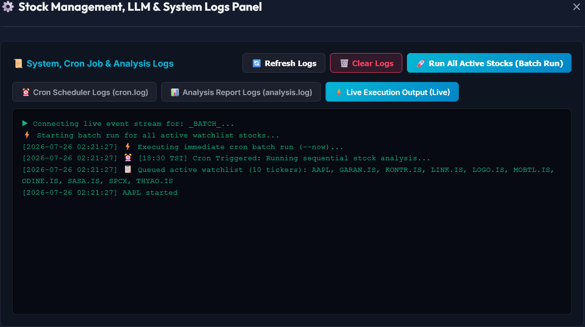
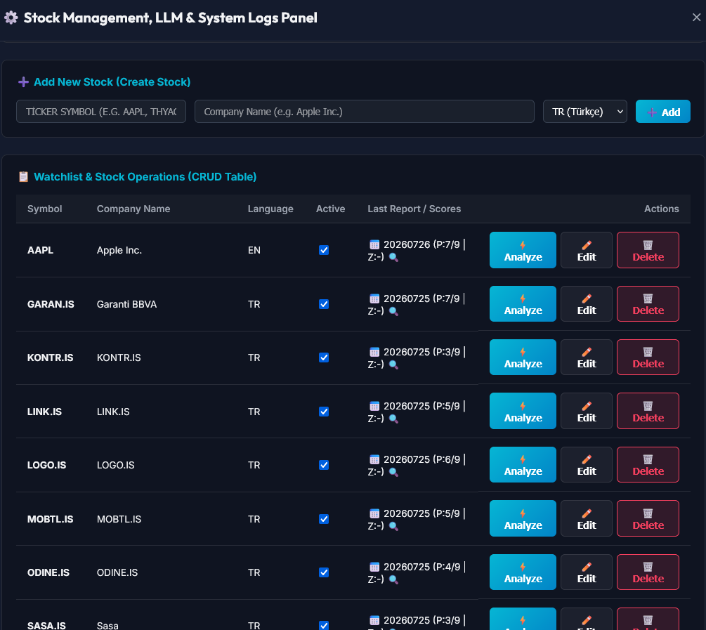
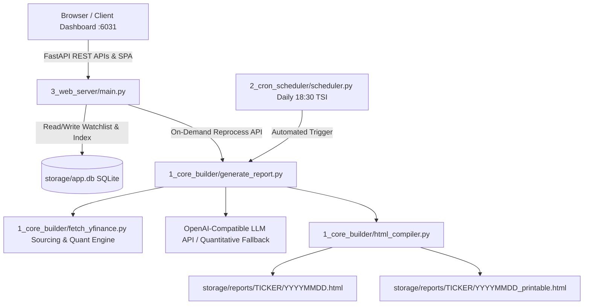
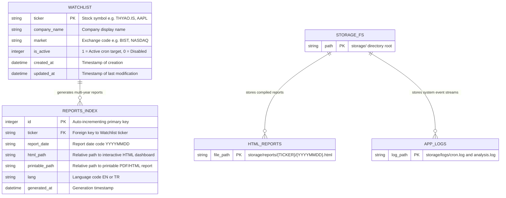

<div align="center">

  

  <br/><br/>

  [](VERSION)
  [](https://www.python.org/)
  [](https://fastapi.tiangolo.com/)
  [](https://www.docker.com/)
  [](LICENSE)

  **🏛️ Universal Global Equity Research Platform, Decoupled SPA Dashboard Viewer & Password-Protected Admin Panel**

  [Overview](#-overview) · [Interface Showcase](#-interface-showcase) · [Features](#-features) · [Quick Start](#-quick-start) · [Docker Deployment](#-docker-deployment) · [Developer Docs](documentation/README.md) · [Changelog](CHANGELOG.md)

</div>

---

## 📖 Overview

**stock-analyzer-app** is a universal, decoupled stock research and equity analysis platform designed for global stock exchanges (US, BİST, European, Asian, and international markets). It automatically sources multi-year financial statements, computes quantitative models (DuPont 5-Step, Piotroski F-Score, Altman Z-Score, Beneish M-Score, WACC, and 2D DCF Sensitivity), generates AI qualitative commentaries via OpenAI-compatible LLM provider APIs, and compiles responsive interactive HTML dashboards and printable PDF reports.

The app features a **Password-Protected Admin Control Panel** for managing watchlists, editing environment parameters in the browser, monitoring live log streams, and triggering single-stock or batch report executions.

---

## 📐 Architecture & Database ERD

### 🏗️ System Architecture Flow



### 🗄️ Database Entity Relationship Diagram (ERD)



---

## 📸 Interface Showcase

### 📊 Interactive SPA Dashboard Viewer
<div align="center">
  <a href="assets/main-app.png">
    
  </a>
</div>

<br/>

### 🔒 Password-Protected Admin Control Panel

| 🔒 Watchlist Management & Reprocessing | ⚙️ In-Browser Environment Settings Editor |
| :---: | :---: |
| <a href="assets/admin-1.png"></a> | <a href="assets/admin-2.png"></a> |
| *Watchlist CRUD & On-Demand Reprocessing* | *Live LLM Parameters & System Log Controls* |

---

## ✨ Features

- 📊 **Institutional Quantitative Models**:
  - **DuPont 5-Step ROE Decomposition** (Tax Burden, Interest Burden, EBIT Margin, Asset Turnover, Financial Leverage).
  - **Piotroski F-Score (0–9)** balance sheet strength audit.
  - **Altman Z-Score** insolvency and bankruptcy risk scoring.
  - **Beneish M-Score** forensic accounting & earnings manipulation detection.
  - **WACC & 2D DCF Sensitivity Matrix** (5x5 Terminal Growth vs. Discount Rate).
- 🌐 **Full Multi-Lingual Engine (i18n)**:
  - 100% independent language report compilation (`EN` / `TR`) with unified JSON catalogs ([`1_core_builder/locales/`](file:///home/doggy/projects/stock-analyzer-app/1_core_builder/locales/)).
  - Complete Web UI internationalization ([`3_web_server/locales/`](file:///home/doggy/projects/stock-analyzer-app/3_web_server/locales/)).
- 🤖 **AI Commentary Engine**:
  - 18-point qualitative financial analysis using OpenAI-compatible LLM APIs (`/v1/chat/completions`).
  - Robust SSE stream parser with fallback to rich quantitative commentary if LLM is unreachable or times out.
- 🎨 **Dual Dashboard Formats**:
  - **Interactive SPA HTML Dashboard** with glassmorphism design, dark/light theme toggle, and Chart.js visualizations.
  - **Single-Page Printable PDF Report** optimized for print and instant export.
- 🔒 **Password-Protected Admin Control Panel**:
  - Web UI secured via `.env` `ADMIN_PASSWORD`.
  - Watchlist CRUD management (Add, edit, delete, activate/deactivate tickers).
  - In-Browser Environment Settings Editor for Admin Password, LLM Provider Base URL, API Key, Model Name, Output Language, LLM Timeout, and Cron Delay Seconds.
  - Reprocessing controls for single stock (`⚡ Analyze`) or batch execution (`🚀 Run All`).
- 📜 **System File Logging & Controls**:
  - Fixed 15-line console log window with custom vertical scrollbar.
  - Separate log tabs for `cron.log`, `analysis.log`, and `Live Execution`.
  - **`🗑️ Clear Logs`** button for instant log truncation on disk and in UI.
- 🐳 **Docker Ready**:
  - 100% self-contained containerized codebase with Docker Compose orchestration.

---

## 🏗️ Architecture & Data Model

### 🧩 System Architecture



### 🗄️ Database ERD & Storage Schema



### 📂 Directory Structure

```text
stock-analyzer-app/
├── logo.svg                # Vector brand header logo
├── .env.example            # Environment configuration template
├── VERSION                 # Central application version file
├── Dockerfile              # Container definition (Python 3.13-slim)
├── docker-compose.yml      # Orchestration for Web Server and Cron Scheduler
├── startdev.sh             # 1-Command local development boot script (proxy)
├── startprd.sh             # 1-Command Docker production boot script (proxy)
├── scripts/                # Boot scripts and rollback infrastructure
│   ├── startdev.sh         # Development server runner
│   ├── startprd.sh         # Production container runner
│   └── __bkp/rollback.sh   # Auto-generated 1-command rollback mechanism
├── 1_core_builder/         # Standalone CLI Report Builder
│   ├── generate_report.py  # Pipeline orchestrator
│   ├── fetch_yfinance.py   # yfinance data sourcing & quantitative models
│   ├── llm_commentary.py   # LLM qualitative commentary engine
│   ├── html_compiler.py    # HTML dashboard & printable PDF generator
│   └── locales/            # Core report builder translation catalogs (EN/TR)
├── 2_cron_scheduler/       # Background Cron Scheduler Worker
│   ├── scheduler.py        # APScheduler worker running daily at 18:30 TSI
│   └── watchlist.json      # Watchlist JSON synced with SQLite DB
├── 3_web_server/           # FastAPI Web Application & Admin Panel
│   ├── main.py             # REST APIs, Admin Modal, Settings Editor & Log Viewers
│   └── locales/            # Web UI translation catalogs (EN/TR)
├── documentation/          # Modular Developer Documentation & Guides
│   ├── README.md           # Documentation index & architecture
│   ├── adding_new_language.md
│   ├── adding_new_financial_metric.md
│   ├── adding_new_report_tab.md
│   └── api_and_web_server.md
└── storage/                # Application persistent data
    ├── app.db              # SQLite database (watchlist & reports_index)
    ├── reports/            # Generated HTML reports per ticker directory
    └── logs/               # Application log files (cron.log & analysis.log)
```

---

## ⚡ Quick Start (Local Setup)

### 1-Command Boot (Recommended)
```bash
./startdev.sh
```
*Boots the FastAPI web application with live reload at `http://localhost:6031`.*

### Manual Installation & Setup
```bash
# Clone the repository
git clone https://github.com/dturkuler/stock-analyzer-app.git
cd stock-analyzer-app

# Create environment file from template
cp .env.example .env

# Run local dev script
./startdev.sh
```

### 3. Running the Web Server & Admin Panel
```bash
python -m uvicorn 3_web_server.main:app --host 0.0.0.0 --port 6031
```
Open `http://localhost:6031` in your browser. Click **🔒 Admin Panel** and log in with your `.env` password.

### 4. Running Single Stock Report CLI
```bash
python 1_core_builder/generate_report.py THYAO.IS --lang TR
```

### 5. Running the Background Cron Scheduler
```bash
python 2_cron_scheduler/scheduler.py
```

---

## 🐳 Docker Deployment

For detailed production deployment instructions on a new VPS (including volume persistence and Cloudflare Tunnel setup), see the [**VPS Production Deployment Guide**](documentation/vps_deployment_guide.md).

### 1. Docker Compose Deployment
```bash
# Build and start Web Server & Scheduler containers
docker compose up -d --build
```

### 2. Container Status & Logs
```bash
# Check container status
docker compose ps

# View Web Server logs
docker logs -f stock_web

# View Cron Scheduler logs
docker logs -f stock_scheduler
```

---

## 📚 Developer Documentation & Guides

For complete extension guides and system maintenance docs, visit the [`documentation/`](documentation/README.md) directory:

- [🌐 **Adding a New Language (i18n)**](documentation/adding_new_language.md): How to add new translation catalogs (e.g. German, French, Spanish).
- [🧮 **Adding a New Financial Metric**](documentation/adding_new_financial_metric.md): How to compute custom quantitative formulas and display them in reports.
- [📊 **Adding a New Report Tab/Module**](documentation/adding_new_report_tab.md): Step-by-step guide for creating new report modules.
- [🌐 **Web Server & API Architecture**](documentation/api_and_web_server.md): REST API endpoints, SQLite database schema, and security details.

---

## ⚙️ Environment Variables

The application manages settings via the `.env` file or the **In-Browser Admin Panel Editor**:

| Variable | Default | Description |
|----------|---------|-------------|
| `ADMIN_PASSWORD` | `change_this_to_your_secure_password` | Password for Admin Control Panel access |
| `ALLOWED_ORIGINS` | `http://localhost:6031` | Allowed CORS origins (comma-separated domain list) |
| `LLM_BASE_URL` | `https://api.your-llm-provider.com/v1` | Base URL for OpenAI-compatible LLM provider |
| `LLM_API_KEY` | `your_api_key_here` | API Key for LLM provider service |
| `LLM_MODEL` | `your_llm_model_name` | Target LLM model name |
| `OUTPUT_LANGUAGE` | `TR` | Default report output language (`TR` or `EN`) |
| `LLM_TIMEOUT` | `120` | Request timeout in seconds for LLM commentary calls |
| `CRON_DELAY_SECONDS` | `15` | Waiting delay in seconds between sequential stock analyses in daily cron job |

---

## 📄 License

This project is licensed under the MIT License - see the [LICENSE](LICENSE) file for details.
