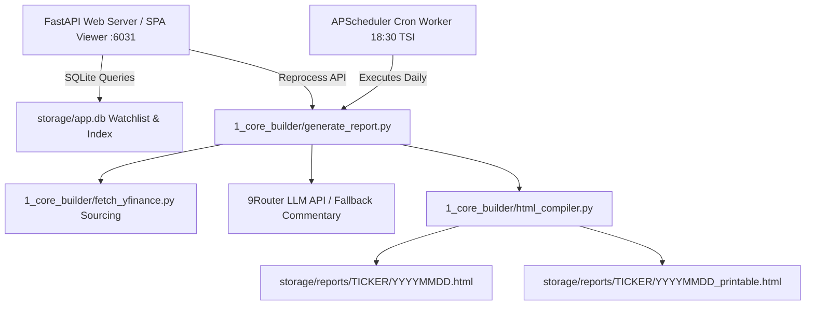

<div align="center">

# stock-analyzer-app

[](VERSION)
[](https://www.python.org/)
[](https://fastapi.tiangolo.com/)
[](https://www.docker.com/)
[](LICENSE)

**🏛️ Universal Global Equity Research Platform, Decoupled SPA Dashboard Viewer & Password-Protected Admin Panel**

[Features](#-features) · [Quick Start](#-quick-start) · [Docker & Release Pipeline](#-docker-deployment--release-pipeline) · [Environment Variables](#%EF%B8%8F-environment-variables) · [Architecture](#-architecture)

</div>

---

## 📖 Overview

**stock-analyzer-app** is a universal, decoupled stock research and equity analysis platform designed for global stock exchanges (US, BİST, European, Asian, and international markets). It automatically sources multi-year financial statements, computes quantitative models (DuPont 5-Step, Piotroski F-Score, Altman Z-Score, Beneish M-Score, WACC, and 2D DCF Sensitivity), generates AI qualitative commentaries via 9Router LLM, and compiles responsive interactive HTML dashboards and printable PDF reports.

The app features a **Password-Protected Admin Control Panel** for managing watchlists, editing `.env` parameters in the browser, monitoring live `cron.log` and `analysis.log` streams, and triggering single-stock or batch report executions.

---

## ✨ Features

- 📊 **Institutional Quantitative Models**:
  - **DuPont 5-Step ROE Decomposition** (Tax Burden, Interest Burden, EBIT Margin, Asset Turnover, Financial Leverage).
  - **Piotroski F-Score (0–9)** balance sheet strength audit.
  - **Altman Z-Score** insolvency and bankruptcy risk scoring.
  - **Beneish M-Score** forensic accounting & earnings manipulation detection.
  - **WACC & 2D DCF Sensitivity Matrix** (5x5 Terminal Growth vs. Discount Rate).
- 🤖 **9Router AI Commentary Engine**:
  - 18-point qualitative financial analysis using OpenAI-compatible 9Router API (`/v1/chat/completions`).
  - Robust SSE stream parser (handles `data: [DONE]` and reasoning models like `deepseek-v4-flash-free` / `code_combo`).
  - Seamless fallback to rich quantitative commentary if LLM is unreachable or times out.
- 🎨 **Dual Dashboard Formats**:
  - **Interactive SPA HTML Dashboard** with glassmorphism design, dark/light theme toggle, and Chart.js visualizations.
  - **Single-Page Printable PDF Report** optimized for print and instant export.
- 🔒 **Password-Protected Admin Control Panel**:
  - Web UI secured via `.env` `ADMIN_PASSWORD`.
  - Watchlist CRUD management (Add, edit, delete, activate/deactivate tickers).
  - In-Browser `.env` Editor for Admin Password, LLM Provider Base URL, API Key, Model Name, Output Language, LLM Timeout, and Cron Delay Seconds.
  - Reprocessing controls for single stock (`⚡ Analiz Et`) or batch execution (`🚀 Tümünü Çalıştır`).
- 📜 **System File Logging & Controls**:
  - Fixed 15-line console log window with custom vertical scrollbar.
  - Separate log tabs for `cron.log`, `analysis.log`, and `Live Execution`.
  - **`🗑️ Logları Temizle`** button for instant log truncation on disk and in UI.
- 🐳 **Docker & Release Pipeline**:
  - 100% self-contained codebase with automated 7-step `/full-release` pipeline for zero-downtime container updates and image pruning.

---

## 🏗️ Architecture



### 📂 Directory Structure

```text
stock-analyzer-app/
├── .env.example            # Environment configuration template
├── VERSION                 # Central application version file
├── release.config.json     # Project release pipeline configuration
├── Dockerfile              # Container definition (Python 3.13-slim)
├── docker-compose.yml      # Orchestration for Web Server and Cron Scheduler
├── 1_core_builder/         # Standalone CLI Report Builder
│   ├── generate_report.py  # Pipeline orchestrator
│   ├── fetch_yfinance.py   # yfinance data sourcing & quantitative models
│   ├── llm_commentary.py   # 9Router qualitative commentary engine
│   └── html_compiler.py    # HTML dashboard & printable PDF generator
├── 2_cron_scheduler/       # Background Cron Scheduler Worker
│   ├── scheduler.py        # APScheduler worker running daily at 18:30 TSI
│   └── watchlist.json      # Watchlist JSON synced with SQLite DB
├── 3_web_server/           # FastAPI Web Application & Admin Panel
│   └── main.py             # REST APIs, Admin Modal, Settings Editor & Log Viewers
└── storage/                # Application persistent data
    ├── app.db              # SQLite database (watchlist & reports_index)
    ├── reports/            # Generated HTML reports per ticker directory
    └── logs/               # Application log files (cron.log & analysis.log)
```

---

## ⚡ Quick Start (Local Setup)

### 1. Prerequisites
- Python 3.10+
- pip

### 2. Installation & Setup
```bash
# Clone the repository
git clone https://github.com/dturkuler/stock-analyzer-app.git
cd stock-analyzer-app

# Create environment file from template
cp .env.example .env

# Create and activate virtual environment
python -m venv venv
source venv/bin/activate  # On Windows: venv\Scripts\activate

# Install dependencies
pip install -r requirements.txt 2>/dev/null || pip install fastapi uvicorn requests yfinance pandas numpy apscheduler python-dotenv beautifulsoup4
```

### 3. Running the Web Server & Admin Panel
```bash
python -m uvicorn 3_web_server.main:app --host 0.0.0.0 --port 6031
```
Open `http://localhost:6031` in your browser. Click **🔒 Yönetim Paneli** and log in with your `.env` password (default: `admin1234`).

### 4. Running Single Stock Report CLI
```bash
python 1_core_builder/generate_report.py THYAO.IS --lang TR
```

### 5. Running the Background Cron Scheduler
```bash
python 2_cron_scheduler/scheduler.py
```

---

## 🐳 Docker Deployment & Release Pipeline

### 1. Single Command Automated Release
To build the Docker image, restart running containers, and prune superseded images, execute:

```bash
bash .agents/skills/full-release/scripts/release.sh
```

### 2. Manual Docker Compose Deployment
```bash
# Build and start Web Server & Scheduler containers
docker compose up -d --build
```

### 3. Container Status & Logs
```bash
# Check container status
docker compose ps

# View Web Server logs
docker logs -f stock_web

# View Cron Scheduler logs
docker logs -f stock_scheduler
```

---

## ⚙️ Environment Variables

The application manages settings via the `.env` file or the **In-Browser Admin Panel Editor**:

| Variable | Default | Description |
|----------|---------|-------------|
| `ADMIN_PASSWORD` | `change_this_to_your_secure_password` | Password for Admin Control Panel access |
| `LLM_BASE_URL` | `https://api.your-llm-provider.com/v1` | Base URL for OpenAI-compatible LLM provider |
| `LLM_API_KEY` | `your_api_key_here` | API Key for LLM provider service |
| `LLM_MODEL` | `your_llm_model_name` | Target LLM model name |
| `OUTPUT_LANGUAGE` | `TR` | Default report output language (`TR` or `EN`) |
| `LLM_TIMEOUT` | `120` | Request timeout in seconds for LLM commentary calls |
| `CRON_DELAY_SECONDS` | `15` | Waiting delay in seconds between sequential stock analyses in daily cron job |

---

## 📄 License

This project is licensed under the MIT License - see the [LICENSE](LICENSE) file for details.
