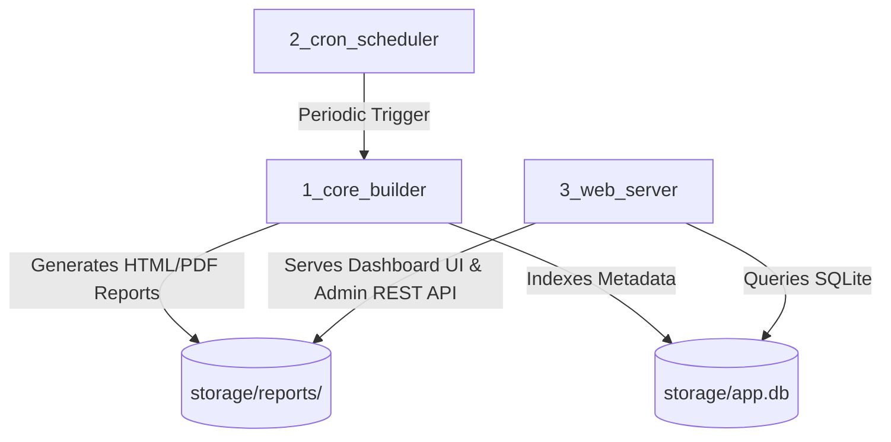

# 📚 Stock Analyzer — Developer Documentation & Extension Guides

Welcome to the developer documentation for the **Stock Analyzer Platform**. This directory contains modular, step-by-step developer guides explaining how to extend, modify, and maintain the codebase.

---

## 🗺️ Documentation Directory

| Document | Description | Target Files |
| :--- | :--- | :--- |
| [**1. Adding a New Language (i18n)**](file:///home/doggy/projects/stock-analyzer-app/documentation/adding_new_language.md) | How to add internationalization catalogs for new languages (e.g. German, French, Spanish). | `1_core_builder/locales/*.json`, `3_web_server/locales/*.json` |
| [**2. Adding a New Financial Metric**](file:///home/doggy/projects/stock-analyzer-app/documentation/adding_new_financial_metric.md) | How to compute and integrate new quantitative metrics, ratios, or forensic formulas. | `1_core_builder/fetch_yfinance.py`, `1_core_builder/html_compiler.py` |
| [**3. Adding a New Report Tab/Module**](file:///home/doggy/projects/stock-analyzer-app/documentation/adding_new_report_tab.md) | How to create a new 360° report tab, investor guide box, and navigation item. | `1_core_builder/html_compiler.py` |
| [**4. Web Server & API Architecture**](file:///home/doggy/projects/stock-analyzer-app/documentation/api_and_web_server.md) | Architecture overview of HTTP handlers, SQLite database indexing, and `.env` settings. | `3_web_server/main.py`, `storage/app.db` |

---

## 🏗️ Architecture Overview

The system is organized into **3 decoupled core services**:

1. **`1_core_builder/`**: Fetches market data via `yfinance`, computes quant metrics (Piotroski F-Score, Altman Z-Score, WACC, DuPont), streams LLM commentary via Open AI API / 9Router, and compiles modern HTML/PDF dashboards.
2. **`2_cron_scheduler/`**: Background automated batch runner that periodically refreshes stock reports.
3. **`3_web_server/`**: Lightweight Python HTTP server hosting the multi-tab Web UI, watchlist management, live log viewer, and system settings.
