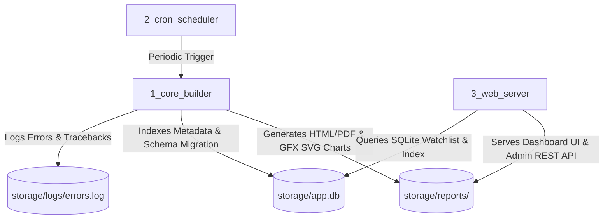

# 📚 Stock Analyzer — Developer Documentation & Extension Guides (v2.3.0)

Welcome to the developer documentation for the **Stock Analyzer Platform**. This directory contains modular, step-by-step developer guides explaining how to extend, modify, and maintain the codebase.

---

## 🗺️ Documentation Directory

| Document | Description | Target Files |
| :--- | :--- | :--- |
| [**1. Adding a New Language (i18n)**](file:///home/doggy/projects/stock-analyzer-app/documentation/adding_new_language.md) | How to add internationalization catalogs for new languages (e.g. German, French, Spanish). | `1_core_builder/locales/*.json`, `3_web_server/locales/*.json` |
| [**2. Adding a New Financial Metric**](file:///home/doggy/projects/stock-analyzer-app/documentation/adding_new_financial_metric.md) | How to compute and integrate new quantitative metrics, ratios, or GFX valuation trend charts. | `1_core_builder/fetch_yfinance.py`, `1_core_builder/html_compiler.py` |
| [**3. Adding a New Report Tab/Module**](file:///home/doggy/projects/stock-analyzer-app/documentation/adding_new_report_tab.md) | How to create a new 360° report tab, GFX chart container, and navigation item. | `1_core_builder/html_compiler.py` |
| [**4. Web Server & API Architecture**](file:///home/doggy/projects/stock-analyzer-app/documentation/api_and_web_server.md) | Architecture overview of HTTP handlers, SQLite database schema migration, and `.env` settings. | `3_web_server/main.py`, `storage/app.db` |
| [**5. VPS Production Deployment & Cloudflare Tunnel**](file:///home/doggy/projects/stock-analyzer-app/documentation/vps_deployment_guide.md) | Production guide for Docker Compose deployment, volume persistence (`storage/`), and Cloudflare Tunnel. | `docker-compose.yml`, `Dockerfile`, `cloudflared` |

---

## 🏗️ Architecture Overview

The system is organized into **3 decoupled core services**:

1. **`1_core_builder/`**: Fetches market data via `yfinance`, computes quantitative metrics (Piotroski F-Score, Altman Z-Score, WACC, Beneish 5-Var Fallback, DuPont 5-Step ROE, 1-Stage & 2-Stage Fade DCF), executes 2-stage LLM commentary pipeline (Stage 1 Quant Audit + Stage 2 Blog Briefing), pre-renders static vector SVG line charts, and compiles HTML/PDF dashboards.
2. **`2_cron_scheduler/`**: Background automated batch runner that periodically refreshes stock reports (Mon-Fri 18:30 TSI).
3. **`3_web_server/`**: Lightweight Python FastAPI web server hosting the SPA Web UI, command palette `⌘K`, slide-over admin drawer, watchlist CRUD, log streaming (`cron.log`, `analysis.log`, `errors.log`, `live`), and system settings.
